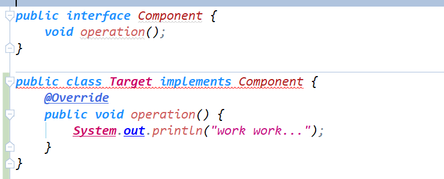
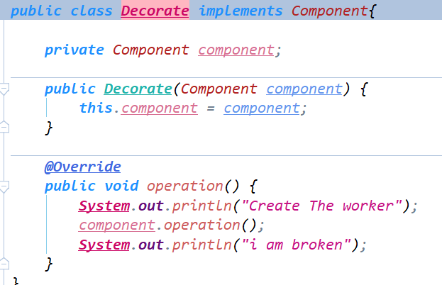

### 常见设计模式

---------------

简介: 常用的设计模式可以分为以下三种

1. 创建型模式：用于描述“怎样创建对象”，它的主要特点是`将对象的创建与使用分离`。GoF 中提供了单例、原型、工厂方法、抽象工厂、建造者等 5 种创建型模式。
2. 结构型模式：用于描述如何将类或对象按某种布局组成更大的结构，GoF 中提供了代理、适配器、桥接、装饰、外观、享元、组合等 7 种结构型模式。
3. 行为型模式：用于描述类或对象之间怎样相互协作共同完成单个对象都无法单独完成的任务，以及怎样分配职责。GoF 中提供了模板方法、策略、命令、职责链、状态、观察者、中介者、迭代器、访问者、备忘录、解释器等 11 种行为型模式。

#### 创建型

##### 单例模式

 区别单例模式的优劣,有以下几种准则

* 效率 
  * 对系统而言,饿汉式的过早创建会导致占用资源,不一定会使用到.相反懒汉式的随用随创建给予系统减少创建对象所产生资源的可行性
  * 对于需要去获取单例对象来说,一旦多个对象同时获取就会存在线程安全的隐患,相反如果使用锁来保证线程安全的话,执行效率也会下降
* 安全
  * `标准饿汉式`不存在线程安全问题,懒汉式存在线程安全问题

##### 原型模式

场景 : Spring中的配置Bean的多例模式


原型分为浅拷贝/深拷贝,java中Object提供了浅拷贝功能,子功能需要实现浅拷贝,只需要实现Cloneable接口(<font color='red'>注意是可以不重写,object类中未实现cloneable方法,但却实现了clone方法</font>)

`Object对象`


`自定义对象`

	


##### 工厂方法&抽象工厂

`区分`

```
* 工厂方法是指  通过定义工厂父类负责定义创建对象的公共接口，而子类则负责生成具体的对象。 
* 抽象工厂是指 负责创建各种工厂对象
* <font color='red'>一个面向的是对象,一个是面向是产生对象的工厂</font>
```


#### 结构型

##### 适配器模式

场景 :  将一个类的接口转换成客户希望的另外一个接口。适配器模式使得原本由于接口不兼容而不能一起工作的那些类可以一起工作。 

`DEMO`

```java
//原有接口
interface Target{
    void  speck();
}
//原有接口实现类
class TargetImpl implements  Target{
    @Override
    public void speck() {
        System.out.println("原先默认");
    }
}

//需求的接口
interface Need{
    void say();
}

//需求接口实现类
class NeedImpl implements  Need{
    @Override
    public void say() {
        // 调用原有接口提供的方法
    }
}

// 目标接口适配器,实现了需求接口,但使用的是目标接口方法
class TargetAdapter implements Need{
	
    //采用组合模式,将目标接口类引入
    private Target target;

    @Override
    public void say() {
        target.speck();
    }
}
```

总结:

* 优点  
  * 将二个不相关的类组合在一起,完成特定的需求
  * 代码复用
  * 较高的灵活性
* 缺点
  * 单从代码看,细节不清晰,调用A接口方法,却被适配成B接口方法
  * 只能够去适配一个类(单继承)
* 注意:  适配器模式是使用在现有系统运行的情况下,而不应该在前期开发过程中使用


##### 装饰者模式

场景:  装饰器模式允许向一个现有的对象添加新的功能，同时又不改变其结构。这种类型的设计模式属于结构型模式，它是作为现有的类的一个包装。 

**装饰器模式是适配器模式的一种特殊类型,注意装饰器模式维护一种is-a的关系,而适配器模式一般情况下维护的是has-a的关系**

例如:

原有接口&类:



实现装饰者模式(Decorate类同样实现Component接口,维护is-a关系):



总结: 

*  优点
  * 装饰者模式可以和被装饰者同步扩展,且不会相互影响
  * 装饰者模式同样是类之间继承的一种替代方案
* 缺点
  * 如果装饰层数过多,代码关系就会变得较为复杂


##### 代理模式

场景:  为其他对象提供一种代理以控制对这个对象的访问

实现方式: 动态代理/静态代理/cglib

具体实现:

* 静态代理(与装饰者模式类似)

* 动态代理

  ```java
  
  /**
   *  动态代理类(代理任何对象)
   *  必须实现InvocationHandler接口
   */
  public class DynamicProxy implements InvocationHandler {
  
      //被代理类
      private Object targetObj;
  
      // 通过构造注入对象
      public DynamicProxy(Object targetObj) {
          this.targetObj = targetObj;
      }
      
      /**
       *
       *  proxy   代理对象
       *  method  代理对象调用的方法
       *  args    调用的方法中的参数
       *
       */
      @Override
      public Object invoke(Object proxy, Method method, Object[] args) throws Throwable {
  
          System.out.println(proxy.getClass().getName());
          System.out.println("开始时间 "+new Date());
          //执行目标方法
          Object invoke = method.invoke(targetObj, args);
          System.out.println("结束时间 "+new Date());
          return invoke;
      }
  }
  ```

  可以看得出

  1. 代理类接受的对象类型是Object,也就是说可以代理任何对象
  2. 代理对象必须实现InvocationHandler接口/方法
  3. 业务的扩展在invoke方法中增强

  

